# Online grocery shopping

** Abstract **

``Welcome to my Online Grocery Shopping Mart..!`` built using PHP! 
 my project is user-friendly and easy to navigate grocery shopping portal. You can 
browse through a wide range of products. 
 In this project, one of the feature that allows customers to easily repeat 
their previous month's order or set of products in the current 
month. Customers can access this feature from their account dashboard and can make any 
necessary modifications or adjustments to their order before completing the transaction. 

This feature is typically referred to as "reorder" or "quick order" and is often accessible from the 
customer's account dashboard or order history. 

## Screenshots

** User Side

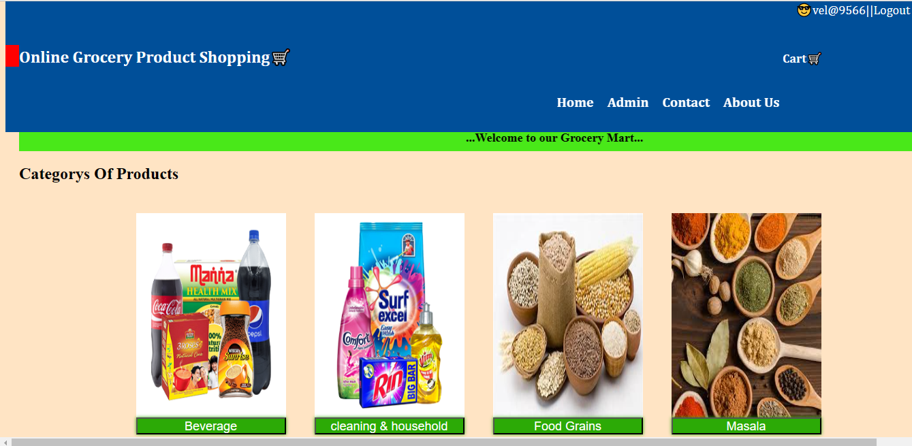

** Product page

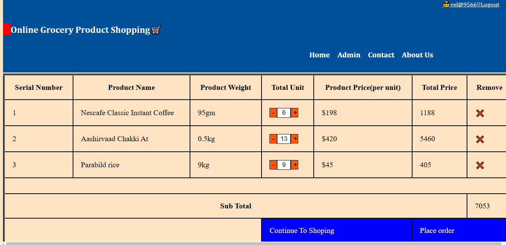

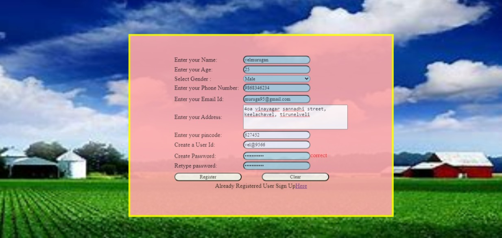

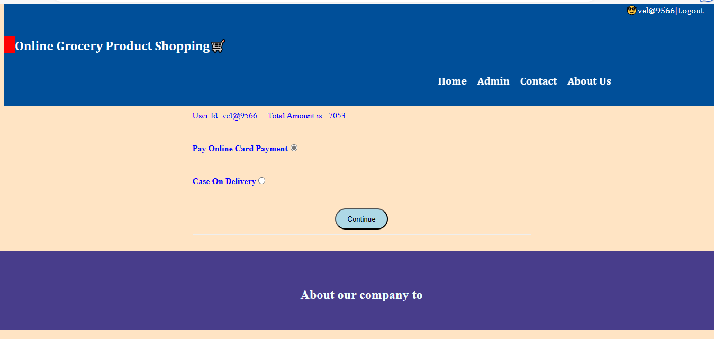

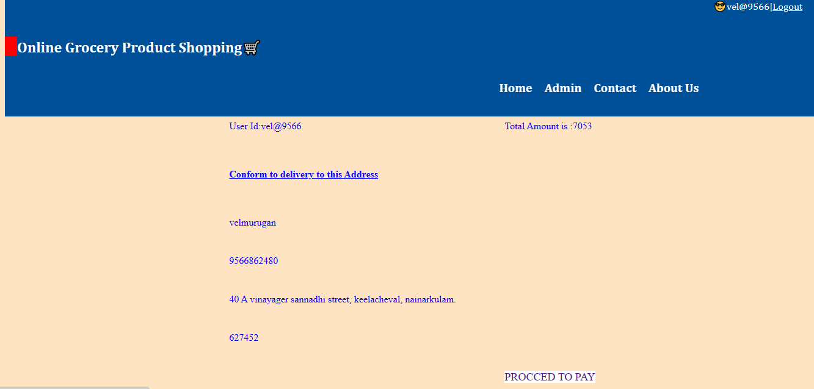

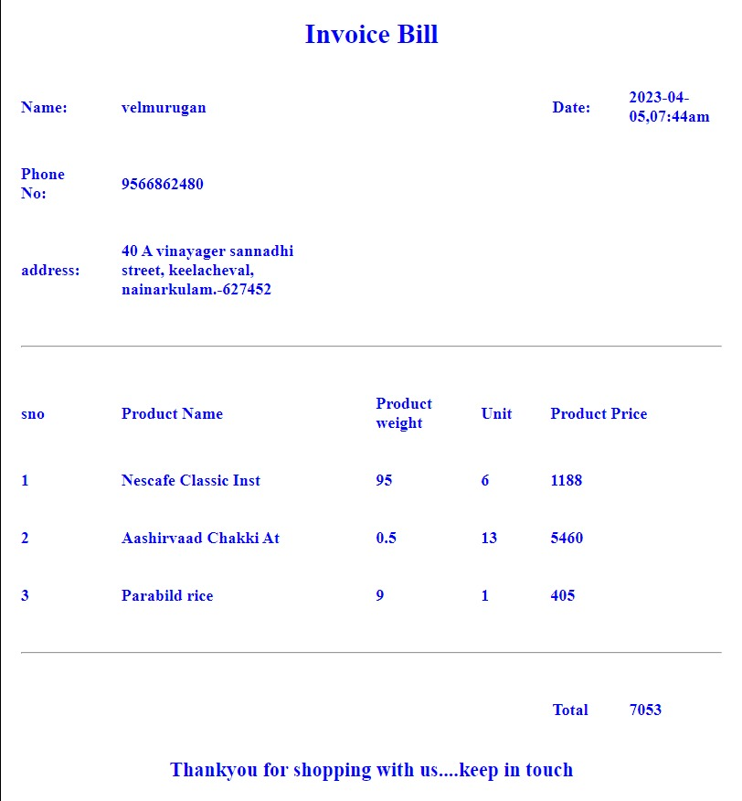

## Main feature of my project 
** Repeat the order **

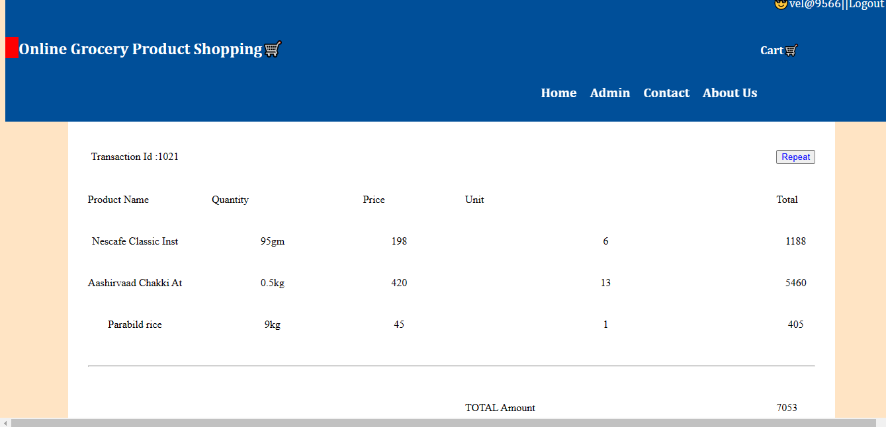

## Admin side

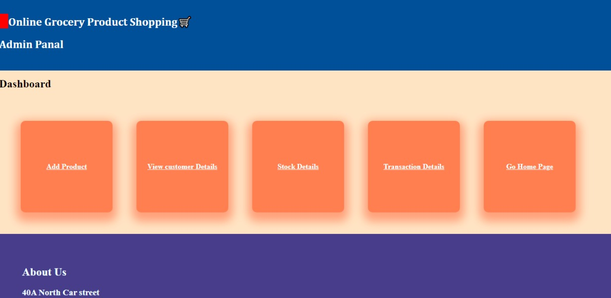

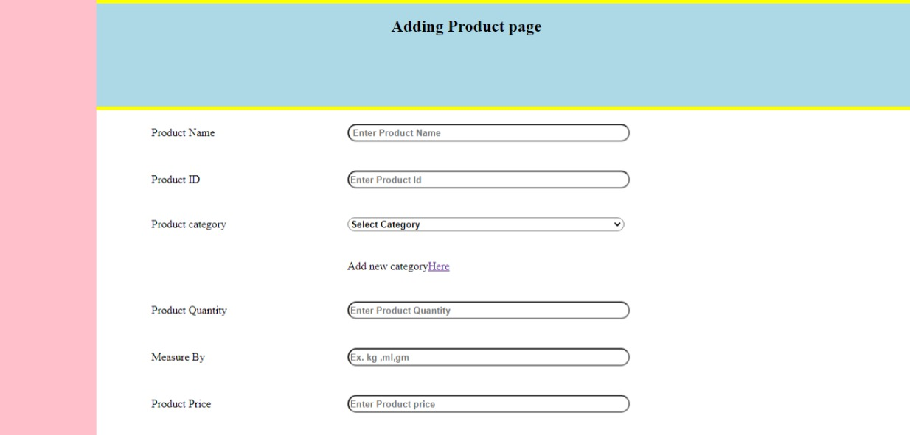

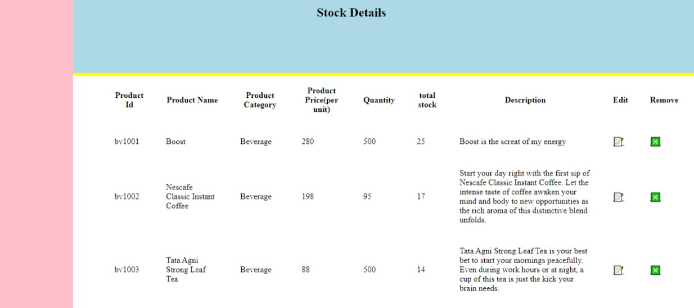

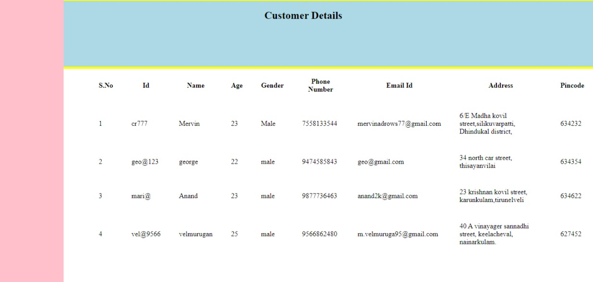

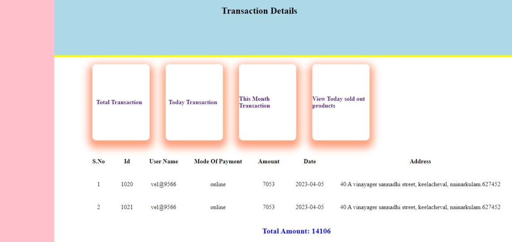

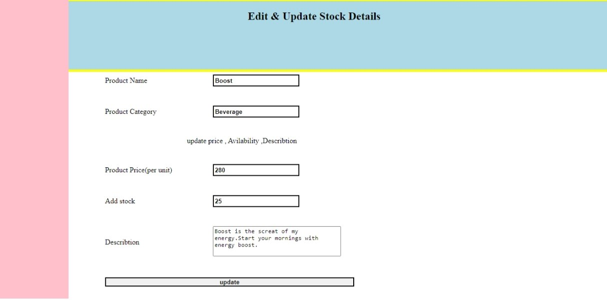

## To Run this project in local 

-- 1 find the database folder in this repository

-- 2 create a database named ``grocery`` 

-- 3 import this repository into htdocs folder in xampp 

-- 4 run the project in chrome or any web browser

